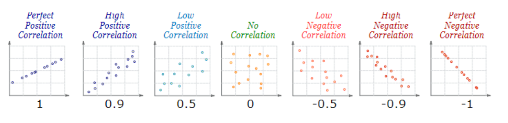
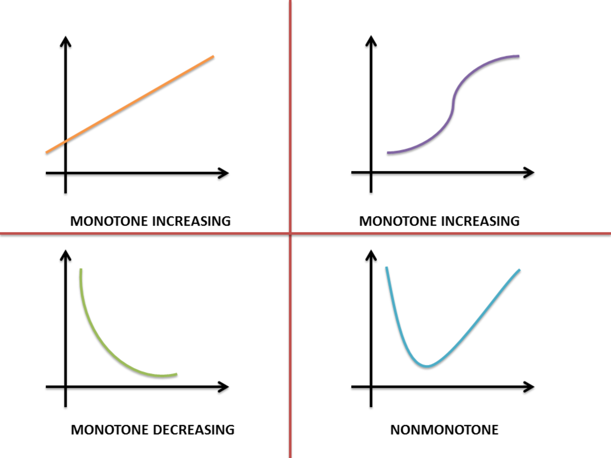
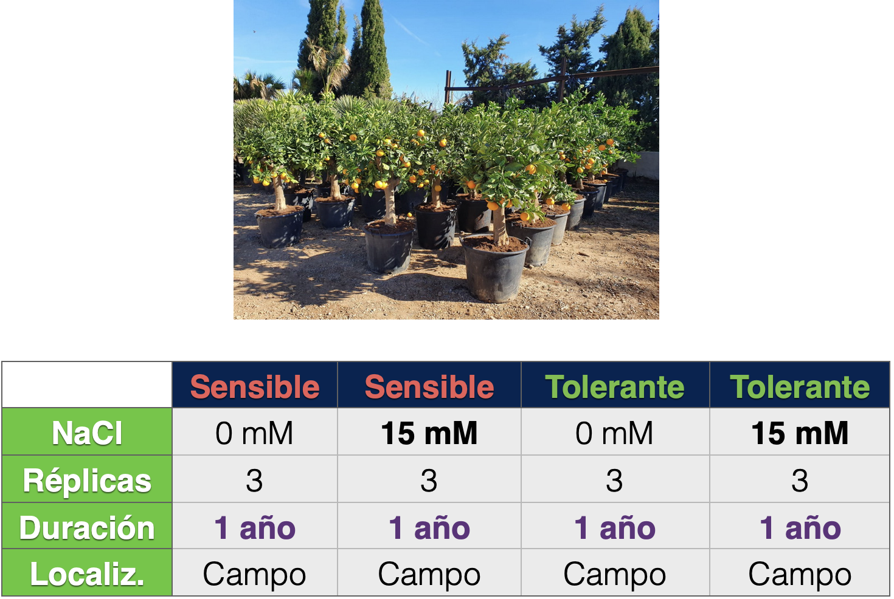

```{r setup, include=FALSE}
# limpia la memoria RAM, siempre que no se definan 'params'
# rm(list = ls()) # Si lo hacemos, se pierden los 'params'

T00 <- proc.time() # initial time

if(!require(knitr, quietly = TRUE)){
  install.packages("knitr", dependencies=TRUE)
  library("knitr")
}
opts_chunk$set(echo = TRUE)

# Definamos unas variables para mostrar bloque de texto en un color concreto
# padding: /* arriba | izquierda y derecha | abajo */
INFER <- "<div style = 'background-color: SlateBlue; 
                        color: white;
                        padding: 10px 10px 8px;
                        margin-bottom: 10px;
                        border-radius: 4px'>**INFERENCE** <br>" # Violet: result interpretation
NOTE <- "<div class='alert alert-info'>**INFO** <br>" # blue: Accessory info to notice or skim
OK <- "<div class='alert alert-success'>**SUCCESS!** <br>" # green: info to be more successful
WARN <- "<div class='alert alert-warning'>**WARNING!** <br>" # yellow: potential negative consequences
DANGER <- "<div class='alert alert-danger'>**DANGER!** <br>" # red: action with dangerous consequences
EXPAND <- '<details  style = "background-color: SeaShell; 
                              border: 2px solid wheat;
                              border-radius: 5px; 
                              padding: 10px 10px 10px 10px;"> 
          <summary markdown = "span" 
                   style = "background-color: mintCream; 
                            color: darkGreen; 
                            padding: 3px 2px 3px 2px;">'
```

# Introducción a la correlación

## La correlación revela tendencias

Decía George Box que _todos los modelos están mal, aunque algunos son útiles_. Lo que quiere decir es que la confección de modelos estadísticos **no pretende cuantificar la verdad**, sino representar fielmente un resumen de las **tendencias** en los datos.




## Coeficientes para medir la correlación

- **_r_ de Pearson** para las relaciones lineales
- **$\rho$ de Spearman** para las relaciones monótonas


<p></p>

Si sospechamos que muchas correlaciones no son exactamente lineales, entonces mejor usamos la $\rho$ de Spearman.
Vamos a ver la diferencia cuando se usa uno u otro coeficiente.

```{r intro, results='hold', warning=FALSE, message=FALSE, out.width='32%', fig.width=2.5, fig.height=3.5, fig.show='hold'}
# Instalar y cargar librerías necesarias
if (!require(ggplot2)) install.packages("ggplot2")

# Configurar semilla para reproducibilidad
set.seed(42)

# ==============================================================================
# CASO 1: RELACIÓN LINEAL PURA
# ==============================================================================
# Los datos siguen una línea recta con un poco de ruido disperso
x_lineal <- seq(1, 10, length.out = 100)
y_lineal <- 2 * x_lineal + rnorm(100, mean = 0, sd = 2) 

pearson_l  <- cor(x_lineal, y_lineal, method = "pearson")
spearman_l <- cor(x_lineal, y_lineal, method = "spearman")

df_lineal <- data.frame(x = x_lineal, y = y_lineal)
p1 <- ggplot(df_lineal, aes(x, y)) +
  geom_point(color = "darkgreen", alpha = 0.7) +
  geom_smooth(method = "lm", color = "black", se = FALSE, linetype = "dashed") + # Línea de tendencia
  labs(
    title = "Lineal",
    subtitle = paste0("Pearson: ", round(pearson_l, 3), "\nSpearman: ", round(spearman_l, 3))
  ) +
  theme_test()

# ==============================================================================
# CASO 2: RELACIÓN MONÓTONA NO LINEAL
# ==============================================================================
x_monotona <- seq(1, 10, length.out = 100)
y_monotona <- exp(x_monotona)

pearson_m  <- cor(x_monotona, y_monotona, method = "pearson")
spearman_m <- cor(x_monotona, y_monotona, method = "spearman")

df_monotona <- data.frame(x = x_monotona, y = y_monotona)
p2 <- ggplot(df_monotona, aes(x, y)) +
  geom_point(color = "blue", alpha = 0.7) +
  labs(
    title = "Monótona No Lineal",
    subtitle = paste0("Pearson: ", round(pearson_m, 3), "\nSpearman: ", round(spearman_m, 3))
  ) +
  theme_test()


# ==============================================================================
# CASO 3: RELACIÓN NO MONÓTONA
# ==============================================================================
x_no_monotona <- seq(-5, 5, length.out = 100)
y_no_monotona <- x_no_monotona^2 + rnorm(100, mean = 0, sd = 2) 

pearson_nm  <- cor(x_no_monotona, y_no_monotona, method = "pearson")
spearman_nm <- cor(x_no_monotona, y_no_monotona, method = "spearman")

df_no_monotona <- data.frame(x = x_no_monotona, y = y_no_monotona)
p3 <- ggplot(df_no_monotona, aes(x, y)) +
  geom_point(color = "red", alpha = 0.7) +
  labs(
    title = "No Monótona",
    subtitle = paste0("Pearson: ", round(pearson_nm, 3), "\nSpearman: ", round(spearman_nm, 3))
  ) +
  theme_bw()

# ==============================================================================
# MOSTRAR LOS RESULTADOS
# ==============================================================================

p1
p2
p3
```

```{r Parada_1}
knit_exit("**Parada_1**: Para seguir, hay que desactivar esta parada poniendo un `#` delante de `knit_exit`.")
```


# Ejemplo con tolerancia a la salinidad

## Define el entorno {.tabset .tabset-fade .tabset-pills}

En este apartado debes incluir todo lo que piensas que se puede cambiar para hacer distintos análisis. De esa manera, no tienes que meterte en el código cada vez que quieras cambiar el nombre de un fichero o algún parámetro.

### Carga la matriz de datos

Vamos a cargar un experimento en el que están los genes de dos portainjertos de cítricos que se expresan en 2 tratamientos de riego diferente durante un año:


<p></p>

```{r CreaMatriz}
# Genes de verdad, con los valores de expresión normalizados en LOG2
matriz <- as.matrix(read.table("recuentos_normalizados.csv",
                               sep=",",
                               header = T,
                               row.names = 1
                               )
                    )

cat("Dimensiones de la matriz (filas x columnas): ", dim(matriz), "\n")

kable(matriz[1:5, 1:6], caption = "rimeras 5 filas y las 6 primeras columnas de la matriz leída")
```

****

### Configura los parámetros

A lo largo del análisis se tomarán decisiones o se eliminarán genes en función de determinados parámetros que se cambiarán aquí.

```{r parametros}
# Definir si queremos usar el CV (TRUE) o el COD (FALSE) para la variabilidad
CV_COD = TRUE

# Variación/dispersión mínima para considerarlos variables
VAR_MIN <- 0.15

# Método de correlación preferido
CORR_METHOD <- "spearman"

# Correlación mínima que se considera útil
R_MIN <- 0.75  # podríamos llegar incluso a 0.9

# Significación estadística mínima, que se puede subir incluso a 0,001
P_MIN <- 0.05
```

****

### Funciones del usuario

El codigo de la función `calculaVars()` es el siguiente:

```{r calculaVarsFunct}
calculaVars <- function(expData){
  # Convertir el formato compatible a data.frame
  tdata <- as.data.frame(expData)
  ini_samples <- ncol(tdata) # columnas con las que calcular los índices

  # Obtaining the mean of the expression values
  tdata$mean <- rowMeans(tdata, na.rm = TRUE)
  
  # Obtaining the dispersion D to each row
  Disp <- function(x){var(x, na.rm = TRUE)/abs(mean(x, na.rm = TRUE))}
  # Apply the function to the expression matrix
  tdata$d <- apply(tdata[, 1:ini_samples], 1, Disp)

  # Obtaining the coefficient of variation CV to each row
  CV <- function(x){sd(x, na.rm = TRUE)/abs(mean(x, na.rm = TRUE))}
  # Apply the function to the expression matrix
  tdata$cv <- apply(tdata[, 1:ini_samples], 1, CV)
  
  # Obtaining the coefficient of dispersion COD to each row
  COD <- function(x){mad(x, na.rm = TRUE)/abs(median(x, na.rm = TRUE))}
  # Apply the function to the expression matrix
  tdata$cod <- apply(tdata[, 1:ini_samples], 1, COD)

  # Return the expression matrix with the mean, the CV and the COD
  return(tdata)
}
```


*** 


## Quédate con los genes que más varían

No tiene ningún sentido calcular la correlación entre los genes que varían poco. Para quedarse con los más variables se hará lo siguiente:

1. Se calcula el **logaritmo de la expresión**.

    ```{r calcLog}
    tmp <- log2(matriz + 1) # se añade 1 para evitar el log(0)
    matriz <- tmp
    rm(tmp)                 # retiramos variables innecesarias
    ```

2. Se calcula los **coeficientes de variabilidad** y se representan CV y COD para ver que el COD siempre acumula menos variabilidad dado que es más insensible a los valores extremos.

    ```{r verCVfreq, results='hold'}
    # cálculo de la variación
    matriz_cv <- calculaVars(matriz)

    # representación superpuesta de COD y CV
    h1 <- hist(matriz_cv$cod, plot = FALSE)
    h2 <- hist(matriz_cv$cv, plot = FALSE)
    
    # procuremos que no queden valores fuera
    x_lim <- c(min(h1$breaks, h2$breaks), max(h1$breaks, h2$breaks))
    y_lim <- c(min(h1$density, h2$density), max(h1$density, h2$density))
    ```


3. Se eliminarán las filas (genes) cuyo CV o COD sea **menor que `VAR_MIN`**. Se representa el resultado.

    ```{r filtrado, results='hold', fig.show='hold'}
    # eliminemos de la matriz los que tienen un CV o COD < VAR_MIN
    if (CV_COD) {
      matriz_cv_filt <- matriz_cv[matriz_cv$cv >= VAR_MIN,]
      tmpText <- "CV"
      tmpData <- matriz_cv_filt$cv # para la representación posterior
    } else {
      matriz_cv_filt <- matriz_cv[matriz_cv$cod >= VAR_MIN,]
      tmpText <- "COD"
      tmpData <- matriz_cv_filt$cod # para la representación posterior
    }
    
    # representamos el resultado
    hist(tmpData,
         breaks = 20,
         ylab = "Frecuencia",
         xlab = "Variación", 
         col = "lightcyan",
         main = paste0("Filtrado por ", tmpText, " > ", VAR_MIN))
    
    rm(tmpData, matriz_cv)
    ```

4. Nos quedaremos con las columnas originales para eliminar las que ha añadido `calculaCVCOD()`, que sirvieron para seleccionarlos genes más variantes. El resultado estará en **`matriz_filt`**, sobre la que calcularemos las correlaciones.

    ```{r matriz_filt}
    matriz_filt <- as.matrix(matriz_cv_filt[,1:ncol(matriz)])
    rm(matriz_cv_filt)                                        # borrar la que tiene más columnas.
    ```

5. Vamos a **guardar la tabla** `matriz_filt` con los genes que más varían en las muestras analizadas en un fichero separado por tabuladores (formato `.tsv`) que podremos utilizar en cualquier momento para hacer cálculos sobre ellos. **Luego vamos a usar esta matriz para ver otras correlaciones**.

    ```{r SaveMostVar_df}
    write.table(matriz_filt,               # datos tabulados a guardar
                file = "matriz-filt.tsv",  # nombre del fichero a crear
                sep = "\t",                # separar las columnas con tabuladores
                quote = FALSE,             # no se usen comillas con los datos
                row.names = TRUE,          # que aparezca el ID de los genes
                col.names = NA)            # las columnas tengan su cabecera sin desfase
    ```

6. **Resumen** del filtrado:

Balance                | Total            | Después `r tmpText` > `r VAR_MIN`
:---                   | :---             | :---
Condiciones (columnas) | `r ncol(matriz)` | `r ncol(matriz_filt)`
Genes (filas)          | `r nrow(matriz)` | `r nrow(matriz_filt)`


```{r Parada_2}
knit_exit("**Parada_2**: Para seguir, hay que desactivar esta parada poniendo un `#` delante de `knit_exit`.")
```


*** 

## Correlación entre las muestras

Lo más rápido y fácil de correlacionar son las muestras (recuerda que corresponden a las **columnas** en la tabla `matriz_filt`. Se espera que las que sean réplicas de la misma situación se parezcan más entre sí que a las otras.

```{r CorrSamples_r, include=FALSE, results='hide'}
# Correlaciones entre samples (por defecto es Pearson)
# redondeamos solo a tres decimales
corr_samples_r <- round(cor(matriz_filt), digits = 3)
kable(corr_samples_r, caption = "Matriz de correlaciones entre las muestras") # ver la matriz de correlaciones
```


```{r CorrSampl_r_Boxplot, include=FALSE, results='hide'}
boxplot(corr_samples_r, 
        main = "Correlación entre las muestras",
        las = 2) # eje X en vertical
```

### Correlación y _P_

Calculemos ahora la correlación así como los valores de _P_ normal y ajustada con el método definido en los parámetros (`r CORR_METHOD`). Tengamos muy presente que la _P_ de la correlación se basa tanto en la _r_ como en el tamaño de la muestra, por lo que _r_ y _P_ siempre estarán correlacionadas. La _P_ se revela muy útil con las muestras pequeñas, en las que es fácil obtener correlaciones altas por casualidad.

Veremos el resultado para comprobar la diferencia que hay entre el triángulo superios (la _P_ ajustada) y el triángulo inferior (la _P_ sin ajustar, sobrevalorada por el _multitesting_). El umbral de corte de _P_ lo hemos definido en la variable `P_MIN`.

* Si _P > `r P_MIN`_ no tenemos potencia estadística para afirmar que haya una correlación lineal entre las variables
* Si _P < `r P_MIN`_ hay una correlación lineal estadísticamente significativa

```{r CorrSamples_rp, message=FALSE, warning=FALSE, results='hold'}
if(!require(psych, quietly = TRUE)){
  install.packages("psych", dependencies=TRUE)
  library("psych")
}

# calculamos las P
corr_samples <- corr.test(matriz_filt, method = CORR_METHOD, ci = FALSE)
```


`r NOTE` 
Vamos a ver que no tiene mucho sentido ver las correlaciones como una tabla llena de números. Veremos que con una gráfica es mucho más claro.
</div>

Mostramos la _P_ para para coeficiente de correlación calculado:

```{r showP_rp, message=FALSE, warning=FALSE, results='hold'}
# vemos la matriz de P para cada correlación con 4 decimales
kable(round(corr_samples$p, digits = 4), caption = "Probabilidad de que la correlación observada sea al azar")
```

`r INFER` 
En este caso está con claridad que la mayoría de las correlaciones son significativas, al tener valores muy bajos de _P_.
</div>


### Correlogramas  {.tabset .tabset-fade .tabset-pills}

Vamos a hacerlo de varias maneras (aunque [hay muchas más](https://r-coder.com/correlation-plot-r/)), teniendo o no en cuenta los valores de _P_.


#### Ideograma muy simple

Veamos cómo se representan los datos con `psych::corPlot()` de manera sencilla muy visual:

```{r corPlot}
corPlot(corr_samples$r, 
        diag = FALSE,               # no pinta la diagonal por ser todos 1
        las = 2,                    # etiquetas de ejes en perpendicular
        cex = 0.5,                  # números no muy grandes
        scale = TRUE,
        pval = corr_samples$p.adj,  # el color refleja la significación P
        main = "Representación de r y P ajustado")
```

`r NOTE` 

- El color depende del signo del coeficiente de correlación
- La intensidad del color depende del valor del coeficiente de correlación

</div>

> **PREGUNTA**: ¿Cuál es la primera conclusión que podemos sacar de esta gráfica sobre el comportamiento de la tolerancia y sensibilidad a la sal?


***

#### Muy intuitivo

La función `corrplot::corrplot()` la usaremos pararepresentar de varias maneras las correlaciones entre muestras. En las distintas pestañas verás distintas maneras de aprovechar sus posibilidades.
Cuidado porque verás que obtienes un mensaje de advertencia porque usa una función obsoleta de `ggplot2`. Como no se actualiza desde 2023, probablemente acabe por no funcionar en unos años.

Lo primero será cargar la librería:

```{r corrPlot-load, message=FALSE, warning=FALSE}
# https://r-coder.com/correlation-plot-r/
if(!require(corrplot, quietly = TRUE)){
  install.packages("corrplot", dependencies=TRUE)
  library("corrplot")
}
```

Representamos las correlaciones y ponemos un título a la gráfica.

```{r corrPlotBasico}
corrplot(corr_samples$r,
         method = "ellipse",
         mar = c(0, 0, 1, 0),   # espacio adicional arriba para el título
         title = "Correlación entre muestras con P y r")
```

`r NOTE` 

- La inclinación de las elipses depende del signo de la correlación
- La intensidad del color depende del valor del coeficiente de correlación
- Cuanto más estrecha sea a elipse, mayor correlación

</div>

***

#### Ideogramas y valores

Añadámosle el coeficiente de correlación en pequeñito, y con el nombre de la muestra solo en la diagonal:

```{r corrPlotSizeR, results='hold', fig.show='hold'}
corrplot.mixed(corr_samples$r, 
               number.cex = 0.7, 
                tl.cex = 0.4, 
               tl.col = "darkgreen",
               mar = c(0, 0, 1, 0),   # espacio adicional arriba para el título
               title = "Correlación entre muestras con r y título")

# la alternativa no usar corrplot.mixed() sería
# corrplot(corr_samples, addCoef.col = 1, number.cex = 0.6)
```

`r NOTE` 

- El color depende del signo del coeficiente de correlación
- La intensidad del color depende del valor del coeficiente de correlación
- El tamaño de los círculos es proporcional a la correlación

</div>


***


#### Marca los poco fiables

La función `ggcorrplot::ggcorrplot()` es un añadido más de la familia de `ggplot()`, por lo que es compatible con sus objetos.. La entrada es compatible con la salida de la función `cor()` y también con la de `corr.test()`. Lo primero será cargar la librería


```{r ggcorrplot-load}
# Instalación o carga del paquete
if(!require(ggcorrplot, quietly = TRUE)){
  install.packages("ggcorrplot", dependencies=TRUE)
  library("ggcorrplot")
}
```


Usaremos el resultado en `corr_samples` que sale de la función `corr.test()` para cambiar el margen de colores con `colors`, representar el triángulo superior con `type`, y tachar las correlaciones que no son significativas pasando los valores de _P_ a `p.mat`. Colocamos también un título.
 
```{r ggp4, out.width='80%', fig.align='center'}
ggcorrplot(corr_samples$r, 
           outline.col = "white", 
           type = "upper", 
           p.mat = corr_samples$p, 
           colors = c("#6D9EC1", "white", "#E46726"),
           title = "De corr.test(), con r y P")
```

***

# Para saber más

* [Correlation Test Between Two Variables in R](http://www.sthda.com/english/wiki/correlation-test-between-two-variables-in-r)
* [Pearson correlation vs. Spearman correlation methods](https://www.surveymonkey.com/market-research/resources/pearson-correlation-vs-spearman-correlation/)
* [Correlation coefficients and tests](https://statsandr.com/blog/correlation-coefficient-and-correlation-test-in-r/)
* [Add p-Values to Correlation Matrix](https://statisticsglobe.com/add-p-values-correlation-matrix-plot-r)
* [Correlation coefficient and correlation test in R](https://www.r-bloggers.com/2020/05/correlation-coefficient-and-correlation-test-in-r/)

***

# Entorno de la ejecución

```{r tiempo_total, results='hold'}
# T00 calculado en el primer chunk
Tff <- proc.time()
T_total <- Tff - T00

print("Tiempo empleado en la ejecución:")
print(T_total)
```

El tiempo de reloj empleado han sido **`r round(T_total[[3]]/60, digits = 2)` min** (`r T_total[[3]]` s).

```{r sessionInfo, results='hold'}
cat("Variables in memory:\n")
ls()
cat("\n")
sessionInfo()
```
